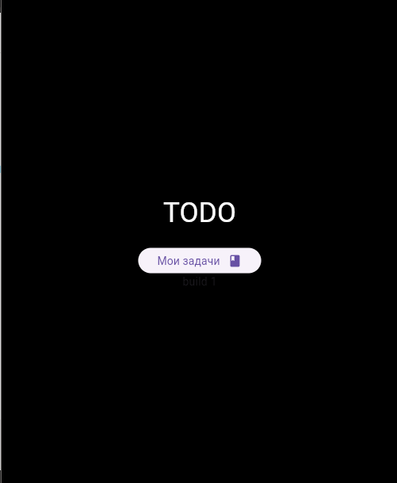
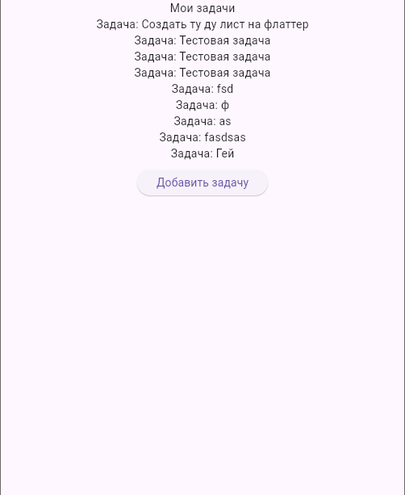

# 📝 TodoFlutter

> Простое, быстрое и красивое приложение для задач, написанное на **Flutter**.


[](https://www.gnu.org/licenses/gpl-3.0)


## ✨ Особенности
- Локальное хранение задач
- Отсутствие рекламы
- Приоритет задач по 3 уровням
- Минималистичный дизайн без лишних функций

| Главный экран | Добавление задачи | Все заметки |
|---------------|-------------------|-------------|
|  |  |  |

⭐Дорожная карта:
- Добавить фото к задачам
- Добавить экспорт и импорт задач
- Добавить редактирование задач
- Изменение темы визуальной

## 🚀 Запуск локально
```bash
git clone https://github.com/IILLUMINATION/todoFlutter.git
cd todoFlutter
flutter pub get
flutter run